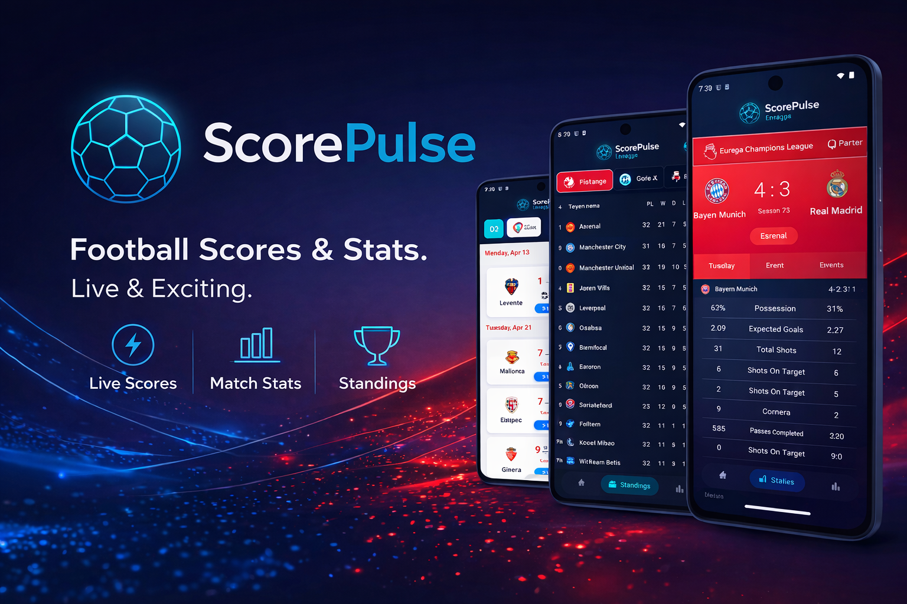
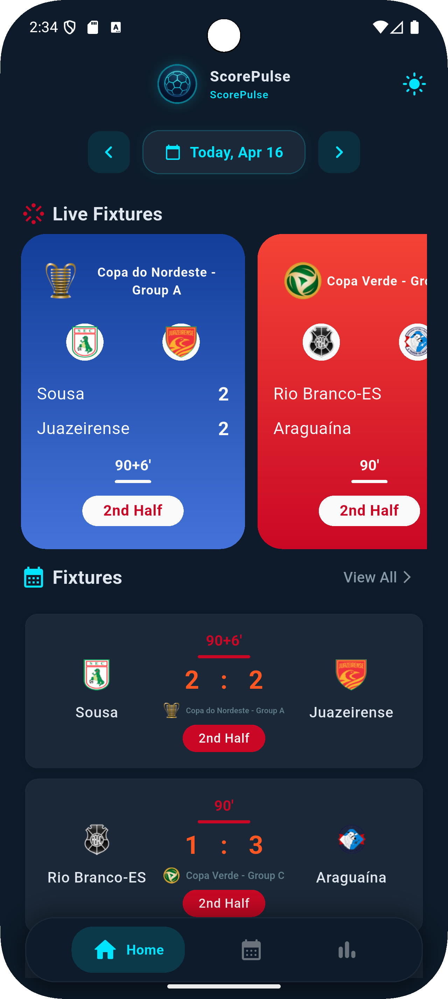
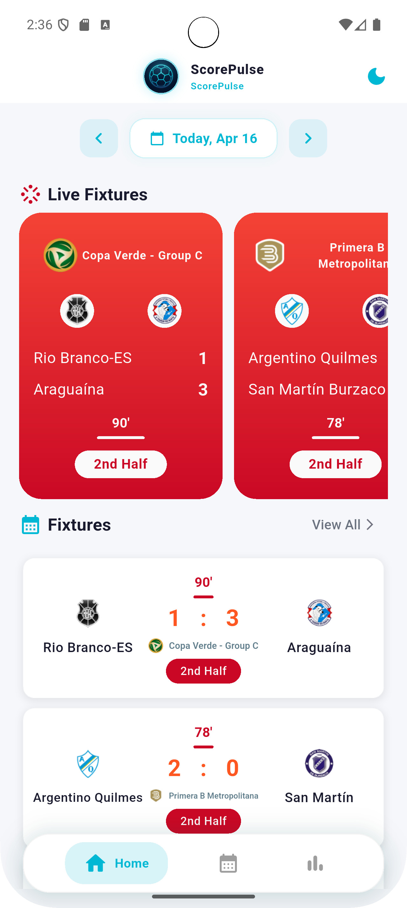
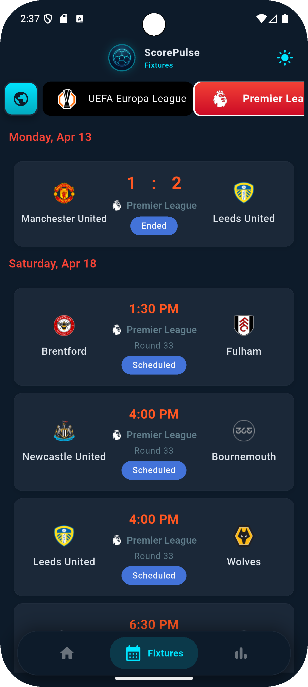
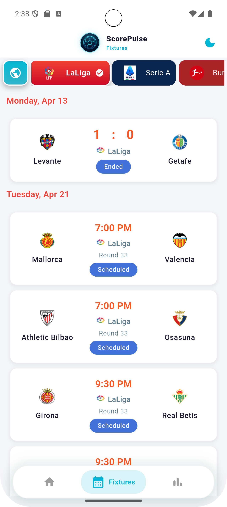
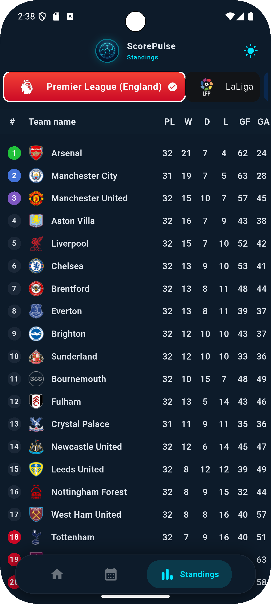
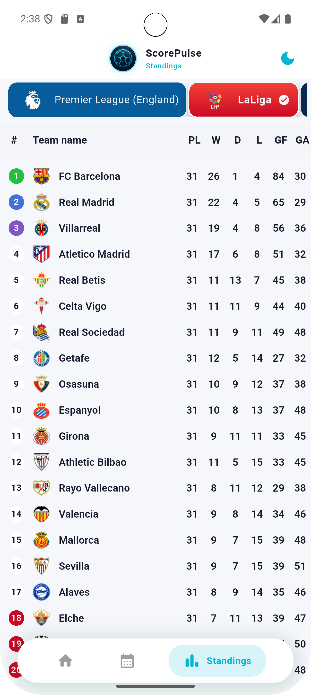
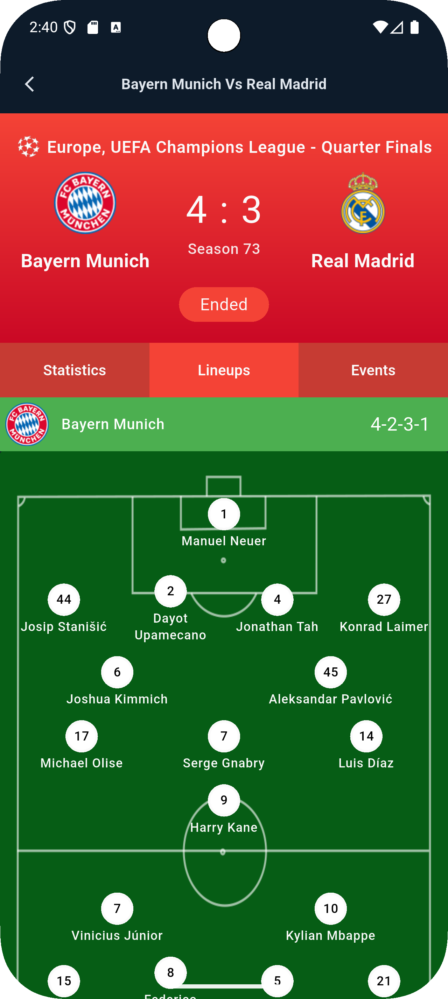
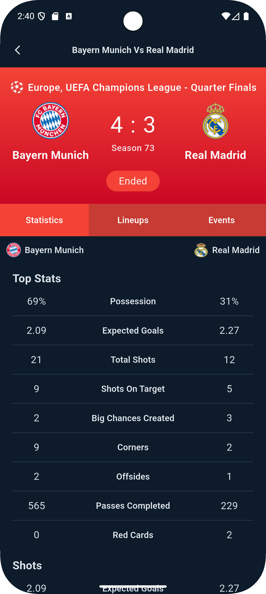
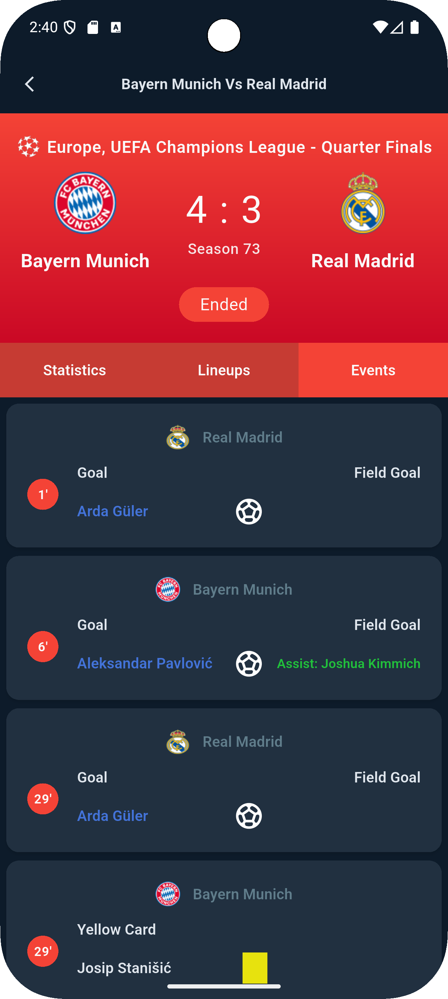

# ScorePulse



> Live football scores, match updates, and standings -- all in one app.


---

## Screenshots

### Home Screen

| Dark Theme | Light Theme |
|------------|-------------|
|  |  |

### Fixtures

| Dark Theme | Light Theme |
|------------|-------------|
|  |  |

### Standings

| Dark Theme | Light Theme |
|------------|-------------|
|  |  |

### Match Details

| Lineups | Statistics | Events |
|---------|------------|--------|
|  |  |  |

---

## Features

- Live match scores and real-time updates
- Date navigator to browse past and future fixtures
- Dark and Light theme with persistence
- All major football leagues including Egyptian Premier League
- League standings table
- Match details: statistics, lineups, and events
- Fast startup and smooth scrolling performance
- Dual API: 365Scores for today, API-Football for other dates

---

## Architecture

- Clean Architecture (data, domain, presentation layers)
- BLoC pattern for state management (no Cubit)
- Repository pattern for data abstraction
- Dependency injection with GetIt

---

## Tech Stack

| Technology | Usage |
|------------|-------|
| Flutter & Dart | Mobile development |
| BLoC | State management |
| Dio | HTTP client |
| GetIt | Dependency injection |
| Cached Network Image | Image loading and caching |
| SharedPreferences | Theme persistence |
| API-Football | Historical and future fixtures |
| 365Scores API | Today live fixtures |

---

## Getting Started

### Prerequisites

- Flutter 3.x
- Dart 3.x
- Android Studio or VS Code

### Installation

```bash
git clone https://github.com/Marco-Mina-Moris/ScorePulse.git
cd ScorePulse
flutter pub get
flutter run
```

### Build APK

```bash
flutter build apk --release
```

---

## API Keys

Add your API-Football key in `soccer_data_source.dart`:

```dart
const apiFootballKey = 'YOUR_API_KEY';
```

Get a free key at: [https://api-football.com](https://api-football.com)

---

## Project Structure

```
lib/
  src/
    config/
      app_theme.dart
    core/
      network/
      utils/
    features/
      soccer/
        data/
          datasources/
          models/
          repositories/
        domain/
          entities/
          repositories/
          usecases/
        presentation/
          cubit/
          screens/
          widgets/
      theme/
        theme_cubit.dart
```

---

## Contributing

Pull requests are welcome. For major changes, please open an issue first to discuss what you would like to change.

---

## License

MIT License

---

Developed by Marco Mina
